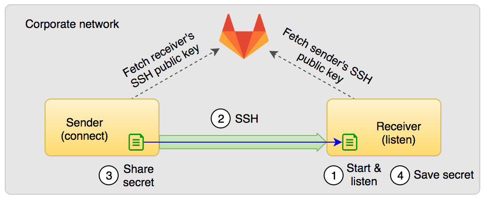
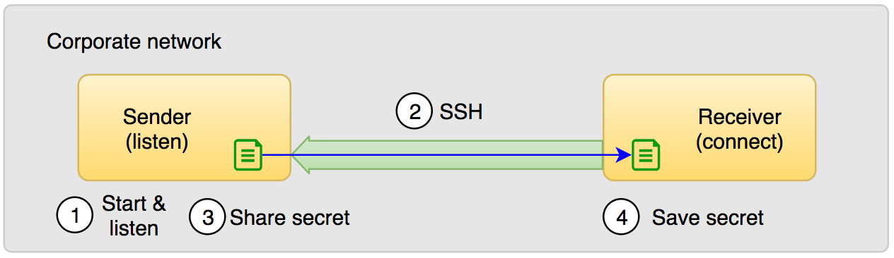
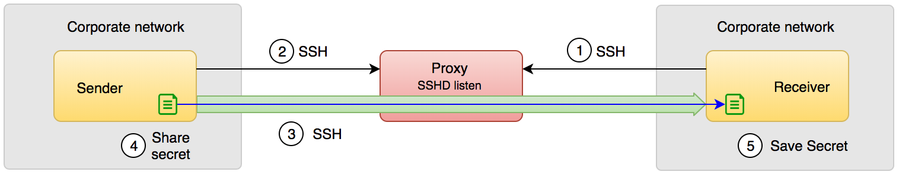

# zcretshare

A command-line tool to share secret/key materials between two (or more) users using SSH keys

`zcretshare` provides a reasonably secure mechanism to share secrets with your co-workers. As an engineer your often would have
enountered situations where you need to share key materials (secrets, key files, license keys etc.) with your co-workers.
The common, but **insecure** practice is to share it over IM/chat channel or email. Sharing secrets through these 
communication channels expose those secrets to their servers in unencrypted form. This poses a significant security risk
to the company. Though PGP (GPG) encryption is the recommended practice, it is not widely used because: (a) not many engineers
have their GPG keys handy with them or published, (b) poor usability - difficulty for the users to learn and use.

### `zcretshare` features:
* Establishes a secure tunnel between workstations and share secrets over it.
* Use your existing SSH setup and keys; no need to create or manage other kinds of keys.
* Usable security: Intuitive to use. Simple send and receive commands.
* Stream the secret over a secure tunnel. Unlike sharing over IM/email, secrets are not stored on third-party servers or exposed to unauthorized access.
* Perfect Forward Secrecy (PFS). Tools such as PGP uses long-lived encryption keys. The long-lived keys are subjected to compromise and can be used to decrypt previous traffic or the encrypted files stored in the email servers. As a result PGP doesn't have the `forward secrecy` property.

Limitations:
* Both sender and receiver have to be online to make this work.
* Though `zcretshare` authenticates the server hosting peer's public key, it cannot provide strong guarantee about the authenticity of peer's pubic key. Hence more suitable in trusted environments, for instance your organiation/employer can act as a trusted third party between sender and receiver (e.g. use corporate authentication enabled source repository to distribute public keys).
* Not suitable for sharing files larger than 200KB (may increase the limit later).

### Scenarios

1. If both users are on same (reachable) network, they may exchange secrets directly as follows:
<p align="center">
  
</p>

2. If the receiver can reach sender but not the otherway. For example, the receiver would be inside a firewall'd network or using non-routable/private IP, hence not directly reachable by sender.
<p align="center">
  
</p>

3. If the sender cannot reach receiver's workstation directly, he/she may use a proxy host (e.g. AWS EC2 instance or a DC host) as follows:
<p align="center">
  
</p>

In the above case, both users should have SSH access to the proxy host.

4. `zcretshare` can also be used to share (push or pull) secrets between Virtual Machines (VM) and BareMetal (BM) Hosts

### Why SSH keys?
* Most engineers are familiar with SSH and its usage.
* As an engineer, you would have used SSH keys to login to remote machines or used it to commit code to source repositories (GitHub, GitLab) etc. -- means you can utilize the same keys, no need to create and manage additional keys for sharing secrets.
* No additional software required for proxy server. It just works with stock OpenSSH daemon.

### Why not TLS & X.509 certificates?
* Unlike SSH keys, X.509 'user' certificates are not widely used. It also requires integration with PKI infrastructure (or use self-signed certificates).
* The burden of managing yet another rarely used keys.
* For proxy use-case, you need to run a TLS proxy server, and even that requires TLS certificates.

### Sharing public keys
The easiest way to exchange public keys between users is to use out-of-band channels - for example, Slack channel or over email, GitHub (personal repo) etc.

## Installation

Supported OS:
* MacOS
* Linux
* Windows

### Build from source

*Build Pre-requisites :*

[GoLang](https://golang.org/dl/)

Set the `GOPATH` and then  try the following command:

```bash
go get github.com/prbinu/zcretshare
```

A `Makefile` is also included. It supports build, test, release, install and uninstall options.

## Usage

**zcretshare receive**
```bash
% zcretshare receive -h
Usage: zcretshare receive [-h] [options]

  -cacert string
    	X.509 CA certificate bundle file; used for -receiver-pubkey HTTPS URL certificate validation. (default: use system CA bunde)
  -connect string
    	Target host to connect; format: host:port (not required if you use -proxy)
  -dangerous-forever
    	Do not exit after processing first request, instead run for ever (not recommended)
  -dangerous-stdout
    	Output secrets to stdout (warning: your secret may get exposed; not recommended)
  -dir string
    	Output file save directory (default "~/.zcretshare")
  -key string
    	SSH private key file to authenticate the receiver (mandatory field) (default "~/.ssh/id_rsa")
  -listen string
    	Listen on host:port; format: [host]:port (not required if you use -proxy)
  -overwrite
    	Overwrites the output file if the file already exists
  -proxy string
    	Intermediate SSH server to connect; format: ssh://user@host[:port]] (not required if you use -listen)
  -proxy-host-pubkey string
    	Proxy host public key file (default "~/.ssh/known_hosts")
  -proxy-key string
    	SSH private key file for proxy authentication (default: use ssh-agent if configured)
  -quiet
    	supress all info messages on stdout
  -rf-port string
    	Proxy SSH RemoteForward port, used with -proxy option (default "15432")
  -sender-pubkey string
    	Sender\'s SSH public key file  - local filename or an HTTPS URL

  Valid options for -proxy:
	-key -sender-pubkey -proxy-key -proxy-host-pubkey -rf-port -overwrite -dir -dangerous-stdout -dangerous-forever -cacert -quiet
  Valid options for -listen:
	-key -receiver-pubkey -overwrite -dir -dangerous-stdout -dangerous-forever -cacert -quiet
  Valid options for -connect:
	-key -receiver-pubkey -overwrite -dir -dangerous-stdout -cacert -quiet

Examples:
	zcretshare receive -listen <your-host-ip>:<15432> -key ~/.ssh/recv_id_rsa  -sender-pubkey ~/.ssh/sender_id_rsa.pub

	zcretshare receive -proxy ssh://<user>@<proxy-ssh-server>:<22> -key ~/.ssh/recv_id_rsa -sender-pubkey https://example.com/sender/id_rsa.pub -dir /tmp

	zcretshare receive -proxy ssh://<user>@<proxy-ssh-server>:<22> -key ~/.ssh/recv_id_rsa -proxy-key ~/.ssh/id_rsa_proxy -sender-pubkey ~/.ssh/sender_id_rsa.pub -dir /tmp

	zcretshare receive -connect ssh://<receiver-host>:<15432> -key recv_id_rsa -sender-pubkey sender_id_rsa.pub -overwrite -dir /tmp

```

**zcretshare send**
```bash
% zcretshare send -h
Usage: zcretshare send [-h] [options]

  -cacert string
    	X.509 CA certificate bundle file; used for -receiver-pubkey HTTPS URL certificate validation. (default: use system CA bunde)
  -connect string
    	Target host to connect; format: host:port (not required if you use -proxy)
  -dangerous-forever
    	Skip exiting after first request, instead run for ever (not recommended)
  -in-file string
    	Secret file to share with the remote party
  -key string
    	SSH private key file for authentication (default: use ssh-agent if configured)
  -listen string
    	Listen on host:port; format: [host]:port (not required if you use -proxy)
  -proxy string
    	Intermediate SSH server to connect; format: ssh://user@host[:port] (not required if you use -connect)
  -proxy-host-pubkey string
    	Proxy host public key file (default "~/.ssh/known_hosts")
  -proxy-key string
    	SSH private key file for proxy authentication (default: use ssh-agent if configured)
  -quiet
    	Supress all info messages on stdout
  -receiver-pubkey string
    	Receiver\'s SSH public key/cert - local filename or an HTTPS URL
  -rf-port string
    	Proxy SSH RemoteForward port, used with -proxy option (default "15432")

  Valid options for -proxy:
	-key -receiver-pubkey -proxy-key -proxy-host-pubkey -rf-proxy -in-file -cacert -quiet
  Valid options for -connect:
	-key -receiver-pubkey -in-file -cacert -quiet
  Valid options for -listen:
	-key -receiver-pubkey -in-file -dangerous-forever -cacert -quiet

Examples:
	zcretshare send -connect ssh://<receiver-host>:<15432> -key ~/.ssh/id_rsa -in-file ~/secret-file.txt -receiver-pubkey ~/.ssh/recv_id_rsa.pub

	zcretshare send -proxy ssh://<user>@<proxy-ssh-server>:<22> -key ~/.ssh/id_rsa -in-file ~/secret-file.txt -receiver-pubkey https://example.com/receiver/id_rsa.pub

	zcretshare send -proxy ssh://<user>@<proxy-ssh-server>:<22> -proxy-key ~/.ssh/id_rsa_proxy -in-file ~/secret-file.txt -receiver-pubkey ~/.ssh/recv_id_rsa.pub

	zcretshare send -listen 0:<15432> -key sender_id_rsa -receiver-pubkey recv_id_rsa.pub -in-file super-secret.txt
```

### Demo

**Receiver**

```bash
% zcretshare receive -listen 127.0.0.1:15432 -key test/id_rsa_test  -sender-pubkey test/id_rsa_test.pub -overwrite  -dir /tmp
  /\_/\
 ( o.o )  SECRET SHARE PROGRAM
  > ^ <   --------------------
Authorized sender(s) key fingerprint (from test/id_rsa_test.pub):
  SHA256:JuUpVhauR02fYEKLbhITm2T+afZolfQvwxSsX4VdurE


Listening on 127.0.0.1:15432

New connection: sender: secret-shell-user	 sender-addr: 127.0.0.1:56381	 key fingerprint:
  SHA256:JuUpVhauR02fYEKLbhITm2T+afZolfQvwxSsX4VdurE
Time: 2019-02-26 11:09:52.486911 -0800 PST
Secret content saved to: /tmp/super-secret-test
Content fingerprint: SHA256:6pqtydvHHizpAWD+Bs83V7NZ/txqkMmwRj6c8xalIPw=
```

**Sender**
```bash
% zcretshare send -connect ssh://127.0.0.1:15432 -key test/id_rsa_test  -receiver-pubkey test/id_rsa_test.pub  -in-file test/super-secret-test
  /\_/\
 ( o.o )  SECRET SHARE PROGRAM
  > ^ <   --------------------
Receiver key fingerprint: SHA256:JuUpVhauR02fYEKLbhITm2T+afZolfQvwxSsX4VdurE
Connected to: 127.0.0.1:15432
Content fingerprint: SHA256:6pqtydvHHizpAWD+Bs83V7NZ/txqkMmwRj6c8xalIPw=
Secret file: test/super-secret-test
Transfer complete!
```

**NOTE** 
Only public-key based authentication is supported. Proxies configured to accept `passwords` or `keyboard-interactive` may not work.
 
